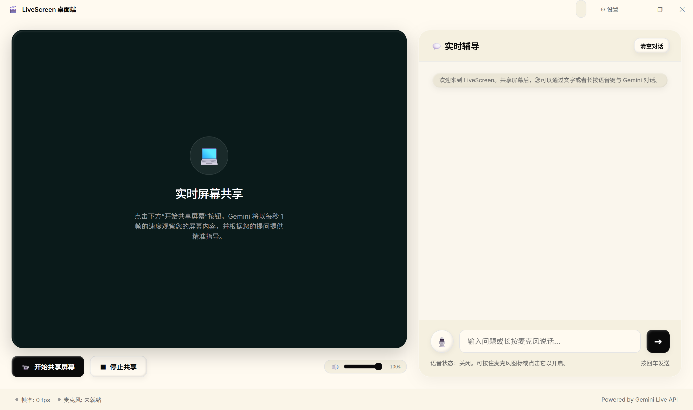
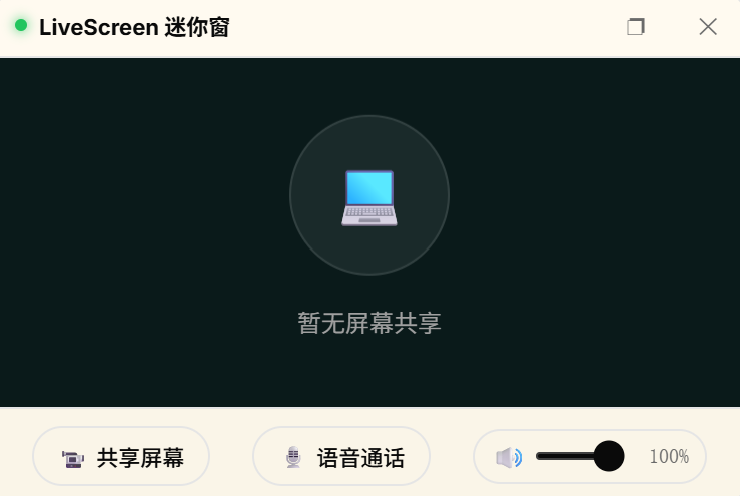
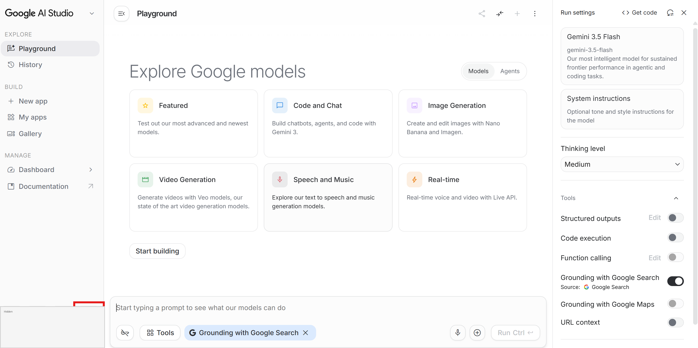
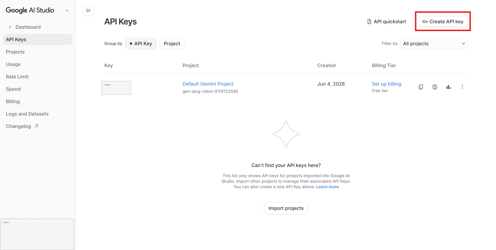

# Gemini LiveScreen 🚀

> **基于 Gemini Live API 的原生 Electron 桌面级实时屏幕与语音辅导助手**

Gemini LiveScreen 是一款将您的电脑屏幕和麦克风音频以极低端到端延迟（E2E）传输至 Google Gemini 实时多模态会话（`gemini-3.1-flash-live-preview`）的桌面级 AI 屏幕辅导工具。它融合了极其 premium 且具现代感的 Clay.com 3D 粘土风格微质感视觉美学，为您提供极低连线阻碍、开箱即用的 AI 伴侣体验。

---

## 🖥️ 效果展示

我们为应用注入了全新的 3D 内阴影高光粘土质感和磨砂玻璃美学设计：

### 🚀 桌面端主窗口与实时屏幕交互


### 🧊 迷你悬浮窗


---

## ✨ 核心特性

### 1. 🎙️ 极致的实时多模态交互 (E2E)
* **屏幕高能效采样**：在保证画质的前提下，自动以 `1fps` 的速率对您的主显示屏幕进行高质量 JPEG 重采样并压缩发送，有效规避 TCP 队头阻塞。
* **低延迟音频流**：采用 **16000Hz PCM 16-bit** 采样率进行麦克风降频采集，完美切合 Gemini API 接收规范。
* **即时打断 (Barge-in)**：引入高性能音源销毁机制，用户随时说话均可实现毫秒级“物理打断”并瞬间静音，配合界面气泡置灰指引。

### 2. ⚡ 零配置智能出网适配 (95% 场景保障)
* **系统代理自动提取**：应用在启动时通过 Electron 底层异步解析操作系统的系统代理（如 Clash / V2ray 开启的 System Proxy），并自动注入至 Node.js 运行环境的 `HTTPS_PROXY` 中，**实现开箱即用，免去手动填写的繁琐**。
* **协议智能 Fallback**：在设置页中填入以 `https://` 开头的 443 端口代理地址时，若触发 TLS 握手层异常，系统将自动回退修正为 `http://` 重新探测测试，并引导用户一键固化。
* **一键连通性测试**：内嵌 8s 超时连线探针，保存设置前可预先对官方 Gemini 接口发起联调校验。

### 3. 🎨 Clay 3D 粘土视觉与悬浮小窗
* **磨砂粘土 UI**：主界面采用 Clay 质感设计，融入 3D 内阴影高光粘土质感和亚克力磨砂磨光，带来耳目一新的视觉震撼。
* **极窄自适应小窗**：按下最小化或 `Alt+Space` 全局快捷键，即可在桌面右下角唤出 1fps 实时缩略图预览悬浮窗，支持 Container Queries 极窄自适应拉伸。
* **自定义标题栏**：支持双击标题栏、全屏/还原按钮（⬜/❐）的双向状态联动。

### 4. 🔐 隐私与安全防漏电
* **系统安全存储**：您的 `Gemini API Key` 在本地均通过操作系统级的高强度加密（Electron `safeStorage`）存储，拒绝明文泄露。
* **硬件级物理防漏电**：在离线、刷新或关闭应用时，全局 `MediaRegistry` 会强行停止所有媒体轨道，确保您的摄像头、麦克风设备指示灯物理安全熄灭。
* **进程自愈**：每次启动时自动安全清扫端口，防范多进程残留占用。

---

## 📂 项目结构

```bash
├── electron/
│   ├── assets/             # 桌面端图标等静态资源
│   ├── windows/
│   │   ├── main-app.html   # 主窗口（粘土玻璃设计，带最大化切换）
│   │   ├── mini.html       # 悬浮小窗页面
│   │   └── settings.html   # 设置窗口（包含 API 探测与 no-drag 修复）
│   ├── main.js             # Electron 主进程 (网络探针、代理 fallback、热键绑定)
│   ├── preload.js          # 安全上下文桥接 (IPC 消息转发)
│   └── store.js            # safeStorage 设置持久化
├── public/                 # 网页端原版 Demo 托管区
│   ├── audio-worklet.js    # Float32 转 PCM 16-bit 音频处理器
│   ├── screen-capture.js   # 屏幕捕获与压缩逻辑
│   ├── style.css           # 粘土美学全局设计系统
│   └── app.js              # 网页端交互主控
├── server.js               # 后端 Express / WebSocket 代理，搭载动态猴子补丁
├── progress.md             # 开发进度跟踪
└── AGY_code                # 辅助开发相关约定
```

---

## 🛠️ 快速开始

### 1. 依赖安装
推荐使用 Node.js >= 20.0.0：
```bash
npm install
```

### 2. 获取并配置 Gemini API Key
LiveScreen 需要一个 Gemini API Key 才能连接 Gemini Live API：

官网入口：[https://aistudio.google.com/apikey](https://aistudio.google.com/apikey)

图示：





1. 打开 [Google AI Studio API Keys](https://aistudio.google.com/apikey)，使用 Google 账号登录。
2. 点击 **Create API key** 创建密钥，并复制生成的 Key（通常以 `AIza` 开头）。
3. **桌面版推荐方式**：首次启动桌面端时会自动打开设置页，也可以点击标题栏“设置”。将 API Key 粘贴到 `Gemini API Key` 输入框，点击“测试连接”确认 Key、代理和 Gemini Live 模型可用后保存。密钥会通过 Electron `safeStorage` 存入本机系统安全存储。
4. **网页版方式**：在项目根目录创建 `.env` 文件并写入：
   ```bash
   GEMINI_API_KEY=你的_API_Key
   ```
   保存后重新运行 `npm start`。

如果你在中国大陆网络环境下使用，建议先开启系统代理；桌面版的代理输入框留空时会自动尝试系统代理或直连。

### 3. 运行应用
* **运行桌面版 (推荐) 📹**：
  ```bash
  npm run electron
  ```
  *应用启动后若未检测到 API Key，会自动为您弹起设置面板并展开获取教程。您可使用“⚡ 自动检测”一键同步您的系统代理。*

* **运行网页版 🌐**：
  ```bash
  npm start
  ```
  在浏览器访问 `http://localhost:3000`。

### 4. 应用打包 📦
支持将应用一键打包为免安装或带安装引导 of Windows 可执行程序（.exe）：
```bash
npm run build
```
打包输出路径位于根目录下的 `dist/` 文件夹。

---

## ⚙️ 代理配置与连通性说明

1. **系统代理模式**：如果您电脑上开启了 Clash / V2ray 且打开了“系统代理”，您**无需**在 LiveScreen 设置页中输入任何代理，直接保持代理地址输入框留空即可顺畅连接。
2. **TUN 网卡模式**：如果您开启了 TUN 模式，所有流量将被网卡强制接管，同样直接留空代理框即可。
3. **需要代理认证**：若您的静态 ISP 代理需要用户名与密码验证，请在设置页中手动将其格式修改为：`http://用户名:密码@IP:端口`。
4. **443 端口代理**：若您的代理端口是 443 且为普通的 HTTP 隧道，请使用 `http://IP:443` 协议（前置以 `http://` 开头），否则强行走 `https://` 会导致 TLS 握手层失败报错。若不慎填错，点击“🔌 测试连接”时系统也会自动为您识别修正。
